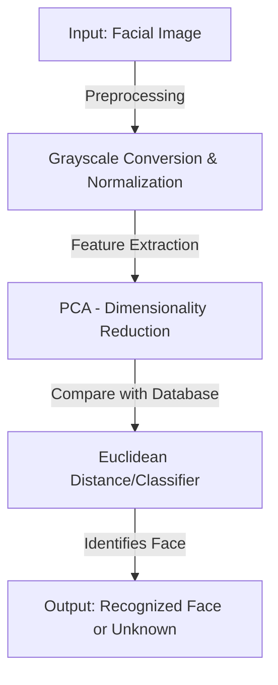

# 👁️ Face Recognition Using PCA


---

## 🚀 Project Overview

The **Face Recognition Using PCA (Principal Component Analysis)** project implements a **machine learning-based face recognition system**. It uses **PCA** for dimensionality reduction and feature extraction from facial images, making the recognition process efficient and accurate. 

> ✨ **Why PCA for Face Recognition?**
> - Reduces **dimensionality** while preserving critical facial features.
> - Enhances **computational efficiency** for recognition.
> - Allows for effective face classification using fewer principal components.

---

## 🔥 System Architecture Diagram



---

## ✨ Key Features

✅ **Principal Component Analysis (PCA)** – Reduces data dimensions while retaining facial structures.  
✅ **Face Detection using OpenCV** – Detects faces before feature extraction.  
✅ **Training & Classification** – Uses PCA-transformed eigenfaces for recognition.  
✅ **Supports Live Webcam Input** – Can recognize faces in real-time.  
✅ **Scalable Dataset Support** – Can train on multiple faces and improve accuracy.  

---

## 📌 Project Scope

### ✅ **In-Scope:**
✔️ Face detection & recognition using **PCA + OpenCV**.  
✔️ Image preprocessing (grayscale conversion, resizing, normalization).  
✔️ Real-time face recognition using webcam input.  
✔️ Eigenface generation and PCA-based feature extraction.  

### ❌ **Out-of-Scope:**
❌ Deep learning-based face recognition (CNNs, DNNs).  
❌ Multi-angle face recognition (works best with frontal images).  
❌ Real-time dataset expansion through user interaction.  

---

## 🛠️ Tech Stack

| Machine Learning | Computer Vision | Tools & Libraries | Dataset |
|-----------------|----------------|------------------|---------|
| Principal Component Analysis (PCA) | OpenCV | NumPy | LFW (Labeled Faces in the Wild) |
| Eigenfaces | Face Detection | Matplotlib | Custom Face Dataset |
| Euclidean Distance Classifier | Webcam Input | Scikit-learn | ORL Face Database |

---

## 🎯 Usage & Execution

### 📌 Prerequisites:
- **Python 3.x**
- **OpenCV, NumPy, Matplotlib**
- **Scikit-learn for PCA implementation**

### 🛠️ Steps to Run the Project:

1️⃣ **Clone the repository:**
```bash
git clone https://github.com/your-github-username/face-recognition-pca.git
cd face-recognition-pca
```

2️⃣ **Install Dependencies:**
```bash
pip install -r requirements.txt
```

3️⃣ **Train the Model:**
```bash
python train_model.py
```

4️⃣ **Run Face Recognition:**
```bash
python recognize_face.py
```


---

## 💡 **Future Enhancements**
✨ **Integration with Deep Learning (CNNs, FaceNet)**.  
✨ **Support for Face Recognition from Video Streams**.  
✨ **Improve Accuracy using Advanced Distance Metrics**.  
✨ **Deploy as a Web App using Flask or FastAPI**.  

---

## 👥 Contributors

- [Suyash Khare]

---

## 📜 License

This project is licensed under the [MIT License](https://opensource.org/licenses/MIT). Feel free to use, modify, and distribute the code for both non-commercial and commercial purposes with proper attribution.

---

## 📞 Contact & Contribution

🤝 Want to contribute? Fork the repo and submit a PR!  
📩 **Contact:** [suyashkhareji@gmail.com](mailto:suyashkhareji@gmail.com)  
🚀 **GitHub Repository:** [Face Recognition Using PCA](https://github.com/your-github-username/face-recognition-pca)

---

Now, your **Face Recognition Using PCA** project has a **stunning, professional, and well-structured `README.md`**. 🚀🔥 Let me know if you need refinements!
